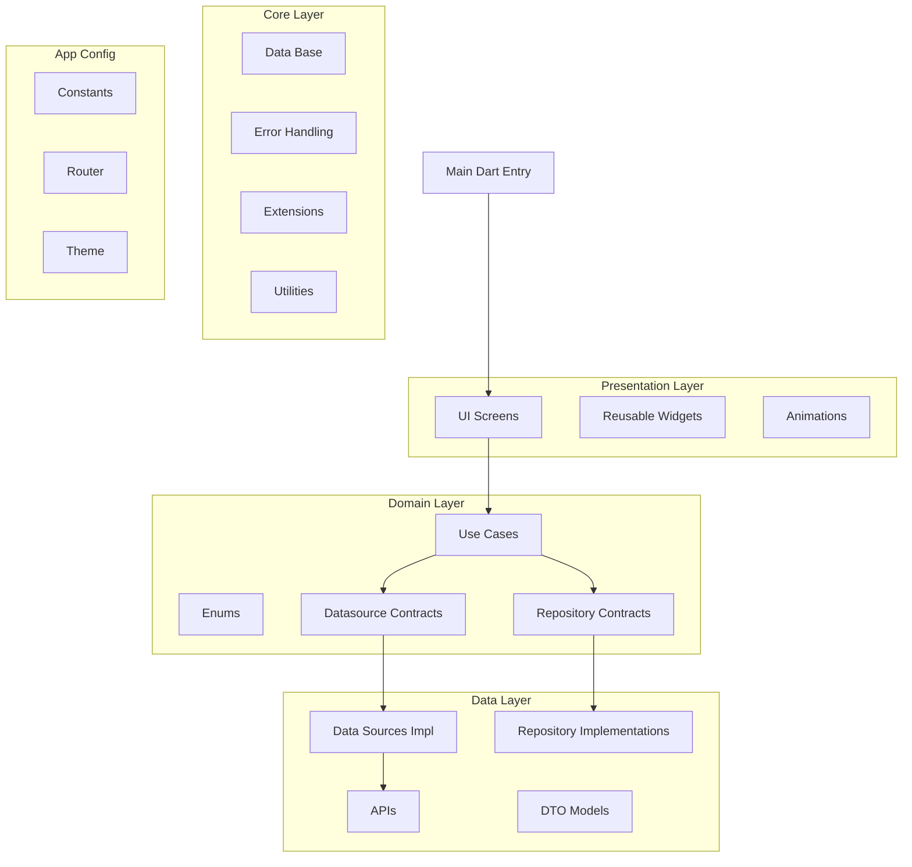

#  planets-3a
3 Astronautas Exam


> [!IMPORTANT]
> This project is *cross-platform:* **Web**, **Android**, **iOS**, **Windows**, **Mac**, **Linux**.

## Project Structure
```dart
lib/
├── app/                    # App-level configuration
│   ├── constants/          # Constantes globales
│   ├── router/             # Configuración de rutas (GoRouter)
│   └── theme/              # Temas y estilos globales
├── core/                   # Infraestructura reutilizable y utilidades globales
│   ├── db/         # Manejo de sesión/local storage (e.g., SharedPreferences)
│   ├── errors/             # Manejo de errores (exceptions, failure classes)
│   ├── extensions/         # Extensiones de Dart/Flutter
│   └── utils/              # Utilidades comunes (formatters, helpers)
├── data/                   # Implementaciones concretas (API, repositorios, etc.)
│   ├── api/                # Endpoints, cliente http o servicios remotos
│   ├── datasources/        # Fuentes de datos (remote/local)
│   ├── models/             # Modelos (DTOs adaptados a cada fuente)
│   └── repositories/       # Implementaciones de los repositorios definidos en domain/
├── domain/                 # Lógica de negocio (pura, sin dependencias externas)
│   ├── datasources/        # Contratos abstractos de fuentes de datos
│   ├── enum/               # Enumeraciones del dominio
│   ├── repositories/       # Interfaces de los repositorios
│   └── usecases/           # Casos de uso del negocio
├── presentation/           # Capa de presentación (UI)
│   ├── animations/         # Animaciones personalizadas
│   ├── ui/                 # Pantallas organizadas por feature/view
│   └── widgets/            # Widgets reutilizables
└── main.dart               # Punto de entrada principal
```

## Architecture




## Environment Setup
---------------------------

### System Requirements

> [!CAUTION]
> Make sure to have the correct version of Flutter installed before running.

* ***Flutter 3.29.1*** or *higher* (*``currently using Flutter 3.29.1``*)
* ***Dart 3.7.0*** or *higher* (*``currently using Dart 3.7.0``*)
* ***VS Code*** *or* ***Android Studio*** with *Flutter* and *Dart* extensions

## Requirements

- [Flutter SDK](https://flutter.dev/docs/get-started/install)
- [Dart SDK](https://dart.dev/get-dart) (comes with Flutter SDK)
- [Android Studio](https://developer.android.com/studio) (for Android app development)
- [Xcode](https://developer.apple.com/xcode/) (for iOS app development)

## Useful links
-----------------

> [!TIP]
> These links could be helpful for a better understanding of how the project is working and organized.

* ***Clean Architecture*** Documentation: [open link](https://celepbeyza.medium.com/introduction-to-clean-architecture-acf25ffe0310)
* ***Flutter*** Documentation: [open link](https://flutter.dev/docs)
* ***Dart*** Documentation: [open link](https://dart.dev/docs)
* ***Riverpod*** Documentation: [open link](https://riverpod.dev)
* ***Retrofit*** Documentation: [open link](https://pub.dev/documentation/retrofit/latest/)
* ***Build Runner*** Documentation: [open link](https://github.com/dart-lang/build/tree/master/docs)
* ***Go Router*** Documentation: [open link](https://pub.dev/documentation/go_router/latest/)
* ***Freezed*** Documentation: [open link](https://pub.dev/documentation/freezed/latest/)
* ***Launcher icon*** Documentation: [open link](https://pub.dev/documentation/flutter_launcher_icons/latest/)
* ***Dot Env*** Documentation: [open link](https://pub.dev/documentation/flutter_dotenv/latest/)
* ***Google Fonts*** Documentation: [open link](https://pub.dev/documentation/google_fonts/latest/)
* ***Material Symbols*** Documentation: [open link](https://pub.dev/documentation/material_symbols_icons/latest/)
* ***Font Awesome*** Documentation: [open link](https://docs.fontawesome.com/)

## Installation
-----------------

### Getting Started

> [!IMPORTANT]
> Make sure to follow these steps to ensure a successful setup of the project.

1. **Clone the Repository**
    - Clone the repository to your local machine:
      ```bash
      git clone https://github.com/johnathan23/planets-3a.git .
      ```

2. **Install Dependencies**
    - Navigate to the project folder and run the following command to install the dependencies:
      ```bash
      flutter pub get
      ```
    - or in android studio go to [pubspec.yaml](./pubspec.yaml) and run pub get

3. **Build runner**
    - run the following command
      ```bash
      flutter pub run build_runner --delete-conflicting-outputs
      ```

## Commands and Scripts
----------------------

### Global Commands

> [!NOTE]
> Libraries are vital to the smooth running of your project, so make sure to keep them up to date.
* **`flutter pub get`**: Gets dependencies for the project
*  **`dart format .`**: Apply format code for the project

> [!WARNING]
> Whenever changes are made to the models or the api folder, make sure to run **`dart run build_runner build`**
> and if any error occurs while running the command, run the following **`dart run build_runner build --delete-conflicting-outputs`**.
* **`dart  run build_runner build build `**: Generates build runner
* **`dart  run build_runner build --delete-conflicting-outputs`**: Generates build runner and deletes conflicting outputs

* **`flutter clean`**: Cleans the project
* **`flutter pub cache clean`**: Cleans the pub cache
* **`flutter pub cache repair`**: Repairs the pub cache

* **`dart run flutter_launcher_icons:generate`**: Generates launcher file icons for the project
* **`flutter pub run flutter_launcher_icons`**: Set launcher icons for the project

## Build Commands

### APK Builds
- **`flutter build apk`**: Builds the APK file.

### App Bundle Builds
- **`flutter build appbundle`**: Builds the app bundle file for distribution.

### iOS Builds
- **`flutter build ios`**: Builds the iOS application for deployment.

### Web Builds
- **`flutter build web`**: Builds the web application for deployment.

> [!NOTE]
> Use the following command to build the web application:
> `-- release`,`-- profile`,`-- debug`

## Version History
-----------------

* ### **v1.1.0** **(2025-07-23)**
    * added: Update Project Structure and Architecture 

* ### **v1.0.0** **(2025-07-21)**
    * added: Initial version of the readme
